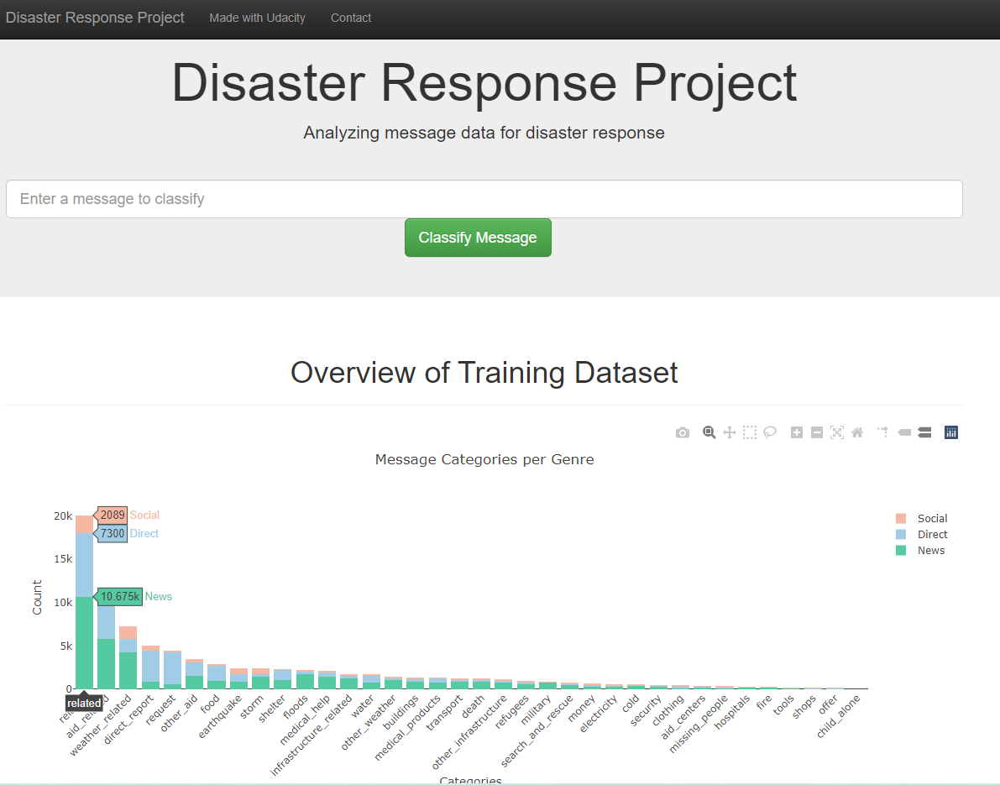
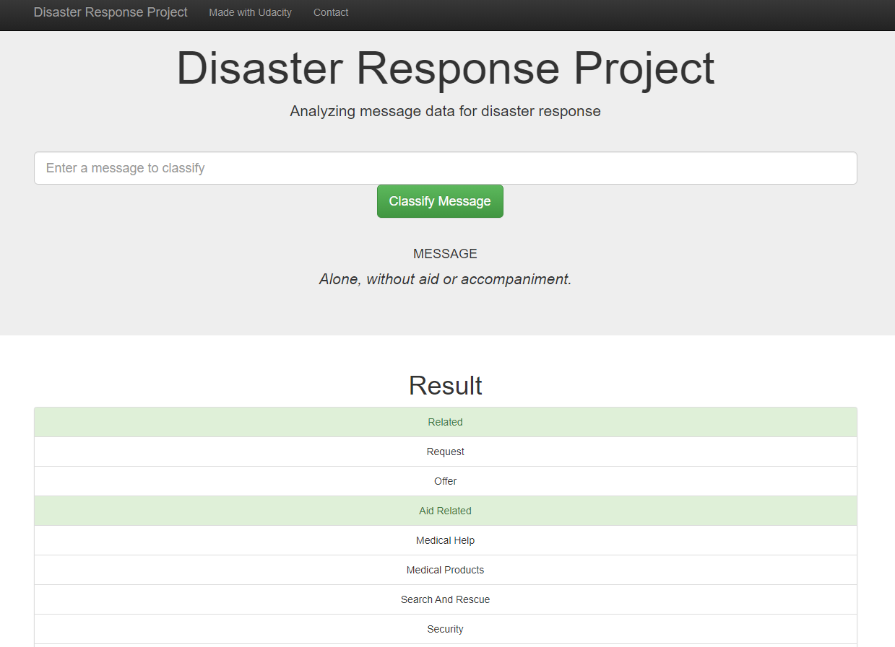

# Udacity Disaster Response
Repository for the Disaster Response Pipeline project from the Data Science Nanodegree from Udacity

## Table of Contents
- [Udacity Disaster Response](#udacity-disaster-response)
  - [Table of Contents](#table-of-contents)
  - [About the Project](#about-the-project)
  - [ETL - Extract, Transform and Load](#etl---extract-transform-and-load)
  - [Machine Learning Pipeline](#machine-learning-pipeline)
  - [Flask APP](#flask-app)
  - [Disclaimers](#disclaimers)
  - [Requirements](#requirements)
  - [License](#license)
  - [Contact](#contact)

## About the Project
Project for the Data Engineering Module of the Become a Data Scientist Udacity's Nanodegree.

The objective of this project is to create a machine learning model to predict which category a message would fit best in a disaster cenario to help organizations to better focus their efforts to bring help for those in need.

The project has 3 main parts:

1. data/process_data.py - Which does the ETL of the data
2. models/train_classifier.py - That create a model to predict the categories of the message
3. app/run.py - A Flask app with a few charts and a "searchbar" to classify any inputed messages

## ETL - Extract, Transform and Load
This file reads the messages.csv and the categories.csv and merge them into one dataframe.

Then it cleans the dataframe separating the categories column hot encoding them (each category is a column and binary values).

Finally it saves the dataframe into a SQLite database.

## Machine Learning Pipeline
This file load the data from the database create in the ETL phase and then build a model to predict the categories of the messages.

The model uses NLP (Natural Language Processing) to extract information from the messages and tokenize it into something we can use and a XGBoostClassifier to effectively classifly the messages into categories.

Since there are several target variables (categories) I used the MultiOutputClassifier function. This function essentialy makes one model for each target variable.

All of this is wrapped in a Pipeline object to better control the ML pipeline.

Lastly the model is saved into the pickle file. Originally this was done inside the train_classifer.py but due some problems with custom modules when saving the pickle file,
it was necessary to dump the pickle from another file. More details in this [stackoverflow article](https://stackoverflow.com/questions/49621169/joblib-load-main-attributeerror)

## Flask APP
The app structure is provided from Udacity and some minor modifications were made.

Both the model pickle file and the database file were uploaded into the app to create more charts and to utilize the "searchbar" to classify any inputed messages.

This app is hosted online, you can access it [here](https://disaster-recovery-gmarafon.herokuapp.com/)

## Disclaimers
For some categories, the dataset is highly imbalanced, this results in a poorer training compared to a balanced dataset.

In the notebooks I tried to make some tests to treat this problem but the results didn't justify the increase in code complexity.

One thing to have in mind when training with highly imbalanced data is not to use accuracy as your metric, because even with dummy classifiers this metric will give "excelent" results. I used precision, recall and f1-score instead, there are also other metrics that you can research that will improve even further your results regarding this problem.

Since the objective of this project was not to focus on the performance of the model, I took advantage to explore things I haven't done before, like implementing XGBoost and parallelize the training and the gridsearch. You can find these experiments in the notebooks.

## Requirements
The requirements of the project are listed in the "requirements.txt" file

## License
Distributed under the MIT License. See `LICENSE` for more information.

## Contact
[LinkedIn](https://www.linkedin.com/in/gfmarafon/)

